# SSL-GCN Molecular Toxicity Prediction

A graph-learning project for binary molecular-toxicity prediction from SMILES. It contains the supervised GCN and baseline-model implementation used for the final experiments, preprocessing and graph-conversion code, notebooks, saved evaluation tables,.

## Problem statement

Experimental toxicity screening is expensive, time-consuming, and difficult to scale across the large number of chemical compounds considered during drug discovery. A compound can also be active in one biological pathway and inactive in another, so a single overall toxicity label is not sufficient for meaningful screening.

This project addresses the problem of predicting whether a chemical compound is active/toxic for each of the 12 Tox21 assay endpoints from its molecular structure alone. The input is a SMILES string; the output is a binary prediction and probability for an endpoint such as the androgen receptor, estrogen receptor, or a stress-response pathway. Because the assay labels are highly imbalanced, accuracy alone can be misleading and ROC-AUC is used as the primary evaluation measure.

## Objectives

- Use the previously prepared toxicity data as the input to a reproducible molecular-graph pipeline.
- Convert valid SMILES strings into molecular graphs with 74-dimensional atom features.
- Train one binary GCN classifier for each toxicity endpoint.
- Compare graph-based predictions with KNN, neural network, random forest, SVM, and XGBoost baselines.
- Report endpoint-level predictions and evaluation metrics through saved files and an optional web interface.

## Proposed solution

The project uses molecular representation learning to replace a flat feature view of a compound with a graph view. Atoms become graph nodes, chemical bonds become edges, and atom-level features are propagated through graph-convolution layers. A graph-level representation is then classified separately for each Tox21 endpoint. Fingerprint-based baseline trainers provide a conventional machine-learning comparison.

### Role of semi-supervised learning

Semi-supervised learning (SSL) is used to make better use of molecular data when only part of the available compounds has toxicity labels. The labeled Tox21 compounds provide the known training signal, while additional molecular records contribute structural information during data preparation. The compounds are standardized, represented from their SMILES strings, and converted into a consistent graph-ready format. This produces a richer prepared dataset for the downstream toxicity-prediction pipeline, where molecular graphs are used to learn endpoint-specific toxicity patterns.

## Architecture and workflow

```mermaid
flowchart LR
    U[SSL-assisted data preparation<br/>labeled + unlabeled molecular data] --> A

    subgraph R[This repository]
        A[Prepared Tox21 assay CSVs<br/>12 endpoint files] --> B[Data loading and cleaning]
        B --> C[Scaffold split<br/>80% train / 10% validation / 10% test]
        C --> D[RDKit SMILES validation]
        D --> E[Molecular graph conversion<br/>atoms, bonds, 74 node features]
        E --> F[Per-endpoint graph datasets]

        F --> G[Supervised GCN<br/>GraphConv + dropout]
        G --> H[Graph pooling<br/>max + average]
        H --> I[MLP binary classifier]
        I --> J[Validation ROC-AUC<br/>early stopping and checkpoint]

        F --> K[ECFP fingerprints]
        K --> L[KNN / NN / RF / SVM / XGBoost]

        J --> M[Predictions and metrics]
        L --> M
        M --> N[CSV/JSON results<br/>and optional FastAPI + React UI]
    end

    style U stroke-dasharray: 5 5
```



The SSL-assisted preparation stage supplies the learning-ready Tox21 assay data used by the graph-learning and baseline-model branches.

Reference diagrams from `labfinal.docx` are included in [assets/](assets/):

- [Workflow reference](assets/workflow-reference.png)
- [Data-flow reference](assets/data-flow-reference.png)
- [Dataset overview](assets/dataset-overview.png)
- [Prediction-screen reference](assets/prediction-screen-reference.png)

The reference images are documentation assets. The Mermaid diagram above is the implementation architecture for this repository.

## Methodology

### 1. SSL-assisted data preparation

The workflow begins by combining labeled toxicity observations with additional molecular data. SSL helps use the labeled and unlabeled portions together: labeled compounds provide toxicity supervision, while unlabeled compounds contribute information about molecular structure and chemical similarity. The resulting records are cleaned, standardized, and organized into a consistent dataset for graph construction.

### 2. Data loading and endpoint definition

Each assay file contains one binary endpoint label, a molecule identifier, and a SMILES string. The 12 files represent the nuclear-receptor and stress-response panels of the Tox21 challenge. Each endpoint is trained and evaluated independently rather than as one multi-task output head.

### 3. Scaffold-based splitting

The preprocessing script groups molecules by Bemis-Murcko scaffold and assigns scaffold groups to train, validation, and test sets with an 80:10:10 target ratio. Keeping related molecular frameworks together reduces the risk that near-identical structures appear in both training and evaluation data. The split metadata and processed graphs are generated under `Data/cache/` when preprocessing is run.

### 4. SMILES-to-graph conversion

RDKit parses each SMILES string and supplies the molecular structure. The graph converter creates an undirected DGL graph: atoms are nodes, chemical bonds are edges, and every node receives a 74-element feature vector made from atom type, degree, formal charge, hydrogen count, hybridization, aromaticity, ring membership, and chirality information. Invalid molecules are skipped and reported by the preprocessing code.

### 5. Supervised GCN model

The implemented model uses three graph-convolution layers with default hidden dimensions of 64, 128, and 256, ReLU activations, and dropout. Node representations are converted to a graph representation by combining learnable-weighted max pooling and average pooling. A two-layer MLP produces the binary toxicity logits. Class-weighted cross-entropy is used to reduce the effect of endpoint imbalance.

### 6. Training and model selection

Models are trained with mini-batches of graphs. Validation ROC-AUC is monitored during training, early stopping is applied, and the best checkpoint is saved as `checkpoints/<endpoint>/best_model.pt`. The held-out test set is used after model selection to calculate accuracy, ROC-AUC, precision, recall, and F1-score.

### 7. Baseline comparison and reporting

The baseline pipeline computes molecular fingerprints and trains KNN, a neural network, random forest, SVM, and XGBoost classifiers. Training histories, endpoint summaries, test metrics, and baseline comparisons are written under `results/`. The optional web application reads available checkpoints and result files for interactive validation, prediction, and research-metric views.

## Dataset

The bundled `Data/csv/` files are the 12 endpoint tables used by this project, with 7,832 rows per assay including the header. The endpoints are:

`NR-AhR`, `NR-AR`, `NR-AR-LBD`, `NR-Aromatase`, `NR-ER`, `NR-ER-LBD`, `NR-PPAR-gamma`, `SR-ARE`, `SR-ATAD5`, `SR-HSE`, `SR-MMP`, and `SR-p53`.

Source links:

- [Official Tox21 Challenge data page](https://tripod.nih.gov/tox21/challenge/data.jsp)
- [Official Tox21 data and tools portal](https://tox21.gov/data-and-tools/)
- [MoleculeNet/DeepChem Tox21 CSV mirror](https://deepchemdata.s3-us-west-1.amazonaws.com/datasets/tox21.csv.gz)

The repository does not claim that its per-assay CSVs are byte-for-byte identical to any one mirror. Check the source release and assay definitions before using the data for a new study.

## Technologies

- Python, pandas, NumPy, scikit-learn
- RDKit for chemical parsing and molecular features
- PyTorch and DGL for graph learning
- XGBoost, matplotlib, and seaborn for baselines and analysis
- FastAPI/Uvicorn backend and React/Vite frontend (optional)

## Project structure

```text
.
├── README.md
├── requirements.txt
├── .gitignore
├── assets/                 # Reference diagrams and project image
├── Data/csv/               # Bundled assay CSVs
├── src/                    # Preprocessing, models, training, prediction, analysis
├── notebooks/              # Exploratory and training notebooks
├── checkpoints/            # Existing GCN checkpoints
├── results/                # Existing metrics and comparisons
└── webapp/
    ├── backend/            # FastAPI service and model loaders
    └── frontend/           # React/Vite client; install dependencies locally
```

Generated graph caches, baseline model pickles, Python environments, `node_modules`, and frontend build output are intentionally not committed. Running preprocessing or training recreates generated outputs.

## Installation and execution

Use Python 3.10-3.12 with a working RDKit and DGL installation. On some platforms RDKit/DGL are easier to install with Conda than pip.

```bash
python -m venv .venv
# Windows: .venv\Scripts\activate
# macOS/Linux: source .venv/bin/activate
python -m pip install --upgrade pip
pip install -r requirements.txt
```

Preprocess all bundled assays:

```bash
python src/data_preprocessing.py
```

Train one endpoint (the default output paths are relative to the repository root):

```bash
python src/train_all_toxicities.py --dataset NR-AhR --epochs 100
```

Train all endpoints:

```bash
python src/train_all_toxicities.py --epochs 100
```

Run a saved-checkpoint prediction:

```bash
python src/predict.py --smiles "CCOc1ccc2nc(S(N)(=O)=O)sc2c1"
```

The baseline trainers are in `src/train_baseline_models.py` and `src/train_all_baseline_models.py`. They create the ignored `models/baseline_models/` directory and write comparison outputs below `results/baseline_models/`.

### Optional web application

Install backend dependencies from the root requirements file, then run the API from its directory:

```bash
cd webapp/backend
uvicorn app:app --reload --port 8000
```

In another terminal:

```bash
cd webapp/frontend
npm install
npm run dev
```

The API expects RDKit, DGL, PyTorch, and available checkpoints. Without those dependencies or model artifacts, only the parts that do not require model inference can run.

## Results

The checked-in result tables are historical outputs produced by the repository. They are not regenerated during cleanup. The GCN aggregate file is [results/overall_summary.csv](results/overall_summary.csv); per-endpoint histories and test metrics are under `results/<endpoint>/`, and baseline comparisons are under `results/baseline_models/`.

The saved GCN test ROC-AUC values in the aggregate file range from 0.6744 to 0.8459 across the 12 endpoints. These are reported repository outputs, not a claim of a newly reproduced experiment; reproduce them after installing the compatible scientific stack and rerunning the pipeline.

## References

- [Tox21 Challenge](https://tripod.nih.gov/tox21/challenge/)
- [Tox21 data and tools](https://tox21.gov/data-and-tools/)
- [MoleculeNet: A Benchmark for Molecular Machine Learning](https://deepchem.readthedocs.io/en/latest/moleculenet.html)
- [DGL documentation](https://www.dgl.ai/pages/about.html)
- [RDKit documentation](https://www.rdkit.org/docs/)
